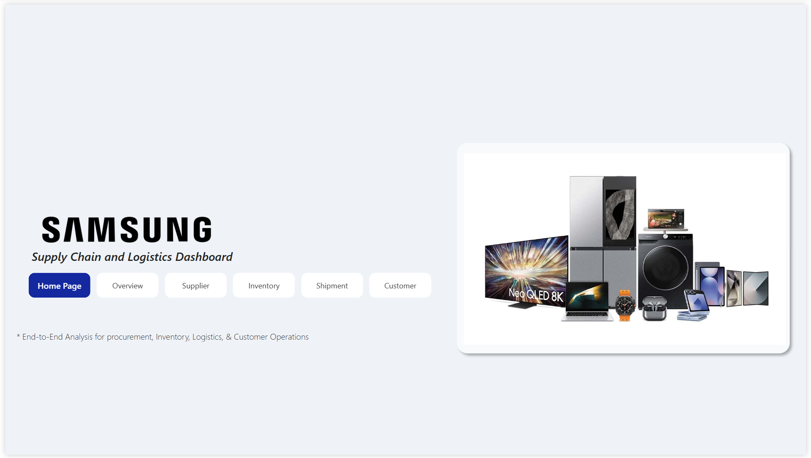
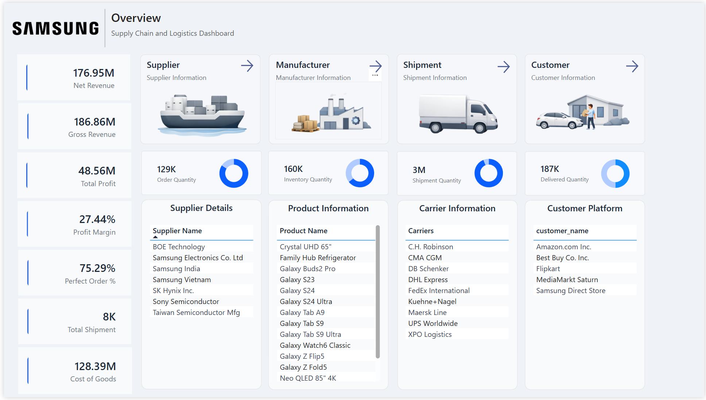
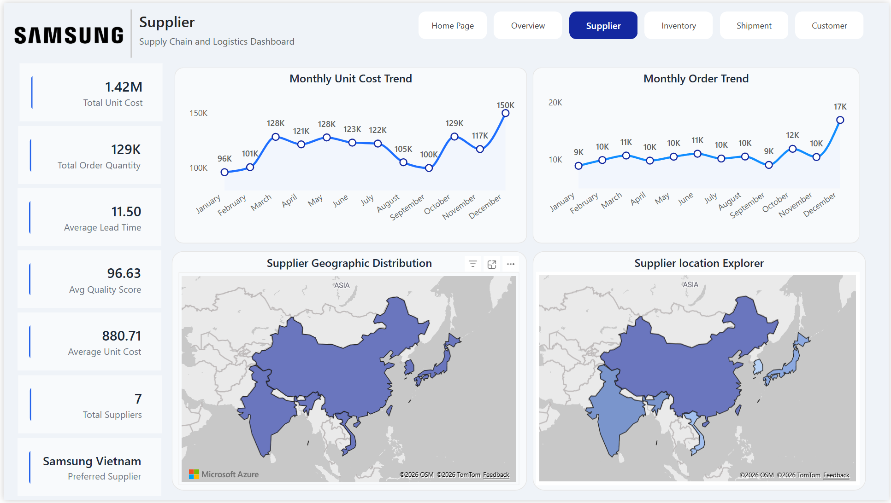
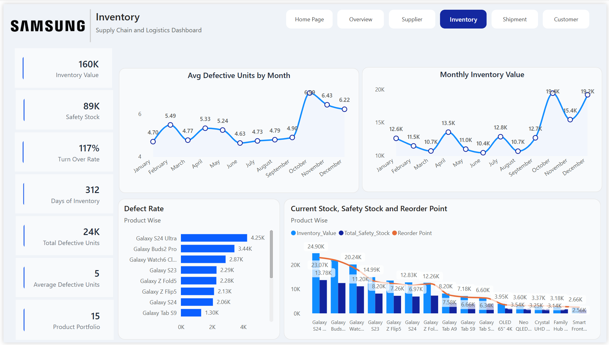
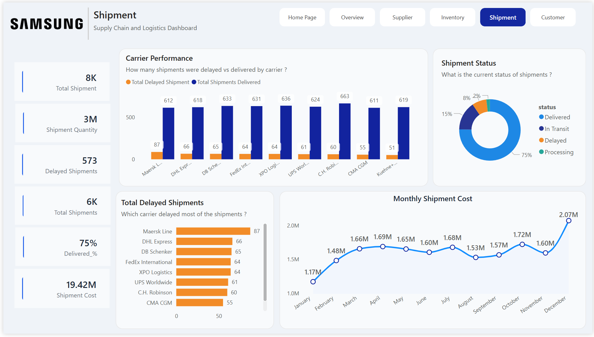
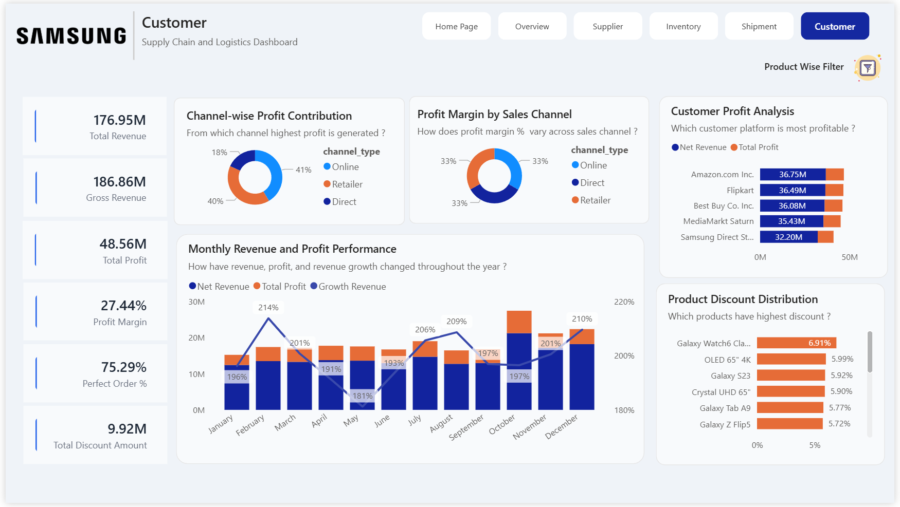

## 📦 Samsung Supply Chain Analysis and Logistics Dashboard

Interactive Power BI daboard built to analyze Samsungs end-to-end supply chain operations. The daboard provides insights accross procurement, inventory, logistics, suppliers, shipments, and customer platforms using interactive visualizations and custom tooltips.

Note: The dataset used in this project is synthetically generated for educational and portfolio purposes and does not represent Samsung's actual business data.

---

### 📌 Overview

This project simulates a real-world supply chain analytics solution for Samsung. The dashboard consolidates operational data into a centralized reporting system, enabling users to monitor business performance and identify operational bottlenecks.

The analysis focuses on:
- Supplier Performance Analysis
- Inventory Management
- Shipment Perofrmance
- Customer & Sales Channel Analysis
- Product Performance
- Supply Chain Overview

---

### 🎯 Business Problem

Samsung operates through multiple suppliers, manufacturers, logistics partners, warehouses, and customer platforms. Business team require a centralized dashboard to monitor operational performance and answer critical business questions.

The dashboard answers questions such as:

Executive Overview
- What is the overall revenue generated ?
- What is the overall profit margin ?
- Which supplier is currently preferred ?
- How many shipments have been completed ?
- What is the total inventory value ?

Supplier Analysis
- Which supplier has the highest average lead time ?
- Which supplier fultilled the highest order quantity ?
- How does supplier performance vary accross countries ?
- Which supplier locations contribute most to procurement ?

Inventory Analysis 
- How the inventory is changing month over month ?
- Which products have the highest defect rate ? 
- Which products are close to thier reorder point ?
- Which products have healthly and unhealthy inventory ?
- How does inventory compare against safety stock ?

Shipment Analysis
- Which carrier delayed most of the shipments ? 
- What are the major causes of shipment delays ?
- How does shipment cost vary monthly ?
- What percentage of shipments are delayed, delivered, in transit, or processing ?

Customer Analysis
- Which customer platform generates the highest revenue ?
- Which sales channel contributes the most revenue ?
- Which channel delivers the highest profit margin ?
- How has monthly revenue and profit changed troughout the year ?
- Which products generate the highest customer profit margins ?

---
### 🛠 Tools and Technologies

- SQL
- Microsoft Power BI
- DAX
- Data Modelling

---

### 🎯 Skills Demonstrated
- Power BI
- SQL
- DAX Query
- Data Modelling
- Supply Chain Analysis
- Data Storytelling
- Interative Report Design 

---

### ✨ Key Features

📊 Customer Revenue and Profit Analysis
- Compare Net Revenue and Total Profit accross major customer platforms.
- Identify the customers contributing the highest business value.

💰 Sales Channel Analysis
- Compare revenue contribution accross  Online, Retailer and Direct Channels.
- Evaluate profit margin percentage for each sales channel.

📈 Monthly Revenue Trend
- Track monthly Net Revenue, Total Profit and Revenue Growth %.
- Identify seasonal sales trends and peak business periods.

🏷️ Product Discount Analysis
- Evaluate product-wise discount percentages.

📌 Dashboard KPI's
This dashboard will help us track important business metrics such as:
- Net Revenue
- Gross Revenue
- Total Profit
- Profit Margin %
- Perfect Order Rate
- Total discount amount.

---

### 💡 Key Business Insights

📌 Customer Revenue Performance: Amazon Inc generated the highest Net Revenue, closely followed by Flipkart making them the largest in revenue contribution.

📌 Customer Profitability: Revenue and profit remained relatively coonsistent accross the top customer platforms, indicating a balanced customer portfolio with no excessive dependence on a single customer.

📌 Sales Channel Contribution: The online channel contributed the largest share of the total revenue, while retailer and direct channels also delivered signigicant business value.

📌 Profit Margin by sales channel: Profit margins remained evenly distributed across all three sales channels, suggesting consistent pricing and profitability regardless of the sales channel.

📌 Monthly Financial Performance: Revenue and profit showed steady growth throughout the yaer, with a stronger finaicial performance during October through December, indicating seasonal demand and year-end sales growth. 

📌 Product Discount Analysis: Products such as Galaxy Wtach 6 Classic recieved the highest discount percentages.

📌 Pricing Strategy: Despite offering approximately 9.92 M in discounts, the business maintained a overall 27.44% profit margin indicating an effective balance between promotional activities and profitability.

📌 Business Health: A 75.29 % perfect order rate, strong cutomer revenue and healthy profit margins indicate effcient customer operations and stable financial performance.

### 📷 Dashboard Screenshots

Homepage

Executive Overview

.png)

.png)

.png)

.png)

Supplier Dashboard

.png)

.png)

Inventory Dashboard

Shipment Dashboard

Customer Dashboard

.png)

